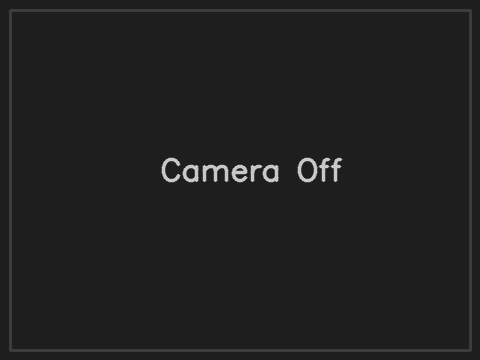

# CodeDex Pro

<p align="center">
  <!-- Logo placeholder: Create a logo.png file in the assets directory -->
  <!--  -->
  <strong style="font-size: 24px;">CodeDex Pro</strong><br>
  <em>The Professional Pokémon TCG Code Scanner</em>
</p>

<p align="center">
  <strong>The Professional Pokémon TCG Code Scanner</strong><br>
  Complete your digital collection, lightning fast.
</p>

<p align="center">
  <a href="#features">Features</a> •
  <a href="#installation">Installation</a> •
  <a href="#usage">Usage</a> •
  <a href="#faq">FAQ</a> •
  <a href="#contributing">Contributing</a> •
  <a href="#license">License</a>
</p>

---

## 🚀 About CodeDex Pro

**CodeDex Pro** is a high-performance QR code scanner and manager specifically built for Pokémon TCG collectors. It allows you to scan, organize, and manage hundreds of Pokémon TCG Online redemption codes at lightning speed, massively reducing the time and effort needed to redeem your digital cards.

<p align="center">
  
</p>

### Why CodeDex Pro?

While the Pokémon TCG Online app allows you to scan codes, it's a tedious, one-at-a-time process. CodeDex Pro was built by collectors for collectors, addressing the real-world need of scanning and managing large quantities of codes efficiently.

## ✨ Features

- **Ultra-Fast Scanning**: Scan QR codes from Pokémon TCG products continuously at high speed
- **Batch Processing**: Scan entire booster boxes or collections in one session
- **Format Flexibility**: Export your codes in various formats (numbered list, comma-separated, space-separated)
- **Code Organization**: Automatically organizes codes into manageable blocks of 10
- **One-Click Copy**: Copy all codes or specific blocks with a single click
- **File Export**: Save your codes as TXT or Markdown files for easy sharing or archiving
- **Sleek, Modern UI**: Dark-themed professional interface that's easy on the eyes
- **Local Processing**: All scanning and processing happens locally - your codes never leave your computer

## 📋 Requirements

- Python 3.8 or newer
- Webcam or camera connected to your computer
- Pokémon TCG code cards

## 🛠️ Installation

### Windows, macOS, and Linux

1. Clone this repository:
   ```bash
   git clone https://github.com/NYTEMODEONLY/codedexpro.git
   cd codedexpro
   ```

2. Install dependencies:
   ```bash
   pip install -r requirements.txt
   ```

3. Run the application:
   ```bash
   python codedexpro.py
   ```

The application will automatically create a `config.json` file with default settings on first run. You can customize settings like camera index, scan intervals, and more by editing this file or through the Settings dialog in the application.

## 📖 Usage

### Basic Usage

1. **Start the Application**: Launch CodeDex Pro
2. **Start Camera**: Click the "Start Camera" button
3. **Scan Codes**: Hold your Pokémon TCG code cards in front of your camera
4. **Export Codes**: Copy your codes to clipboard or export to file in your preferred format

### Export Options

CodeDex Pro offers multiple ways to save and share your codes:

- **Copy to Clipboard**: Quickly copy all codes or specific blocks with dedicated buttons
- **Export as TXT**: Save codes as plain text files (one code per line) for maximum compatibility
- **Export as Markdown**: Create beautifully formatted markdown files with proper headings and code formatting

### Tips for Optimal Scanning

- **Good Lighting**: Ensure adequate lighting for faster and more accurate scanning
- **Card Positioning**: Hold the card steady with the QR code clearly visible
- **Distance**: Keep the code 15-30cm (6-12 inches) from the camera
- **Batch Scanning**: For maximum efficiency, organize cards in stacks for continuous scanning

## ❓ FAQ

**Q: Is this an official Pokémon app?**  
A: No, CodeDex Pro is an unofficial, fan-made application designed to help Pokémon TCG collectors.

**Q: Is CodeDex Pro free to use?**  
A: Yes, CodeDex Pro is completely free and open source.

**Q: Do my codes get shared or uploaded anywhere?**  
A: Absolutely not. CodeDex Pro processes all codes locally on your machine. Your valuable codes never leave your computer.

**Q: Can I scan codes that don't have QR codes?**  
A: Yes! You can manually enter codes using the "Add Code" button.

**Q: How do I save my scanned codes for later use?**  
A: CodeDex Pro offers multiple export options including copying to clipboard or saving as TXT/MD files.

## 🤝 Contributing

Contributions are welcome! Please feel free to submit a Pull Request.

1. Fork the repository
2. Create your feature branch (`git checkout -b feature/amazing-feature`)
3. Commit your changes (`git commit -m 'Add some amazing feature'`)
4. Push to the branch (`git push origin feature/amazing-feature`)
5. Open a Pull Request

## 📜 License

This project is licensed under the MIT License - see the [LICENSE](LICENSE) file for details.

## 🙏 Acknowledgments

- Special thanks to all Pokémon TCG collectors who inspired this project
- Pokémon is a trademark of Nintendo, Creatures Inc., and GAME FREAK Inc.
- This application is not produced by, endorsed by, supported by, or affiliated with Nintendo or The Pokémon Company.

---

<p align="center">
  Made with ❤️ by <a href="https://nytemode.com">NYTEMODE</a> for the Pokémon TCG community
</p> 